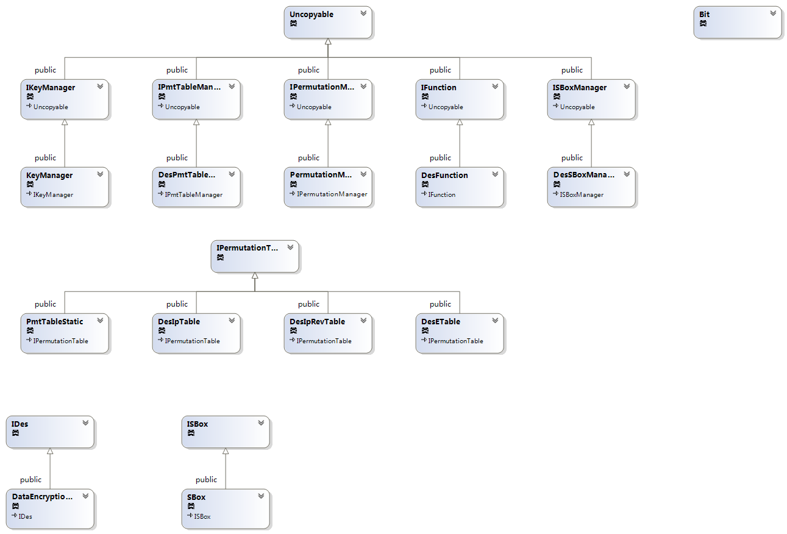

CyDES
=====

高内聚低耦合可复用的DES加密系统  
  
  
  
  
Bit类是最基本的类，它表示一组不超过64位的数据。  

IPermutationTable接口提供了置换表的表示方法，ISBox接口提供了S-Box的表示方法。  

而IPmtTableManager接口用来管理所有置换表，ISBoxManager接口用于管理S-Box。  

IPermutationManager接口提供了用一个置换表置换一组数据的方法。  

IKeyManager接口与IFunction接口表示了DES加密中的两个重要过程，子密钥生成以及f函数。  

IDes接口封装了DES内部的实现，它在内部实现加密的具体步骤，提供了直接的加密方法供外界调用。  

IEncryptor接口则是最后一层外壳，它是整个程序与外界交互的唯一平台。它提供四种可选操作模式。   
   
IMode操作模式的接口，将数据分组加密。  
  
   
使用示例  
----  
测试代码：  
			
	// 样例
	void Example() {
		string str;
		string txt;
		auto encryptor = new DesEncryptor();
		unsigned long long Key;
		vector<unsigned char> dat;

		//str = "Data Encryption Standard Mode Test";
		str = "12345678";
		Key = 12345678987654321LL;

		// ECB模式测试
		cout << "ECB模式测试" << endl;
		dat = encryptor->EncryptString(str, Key, DesEncryptor::ECB);
		cout << "密文：";
		for each (unsigned char var in dat) cout << (int)var << " ";
		cout << endl;
		txt = encryptor->DecryptString(dat, Key, DesEncryptor::ECB);
		cout << "明文：";
		for each (unsigned char var in txt) cout << (int)var << " ";
		cout << endl << txt << endl << endl;

		// CBC模式测试
		cout << "CBC模式测试" << endl;
		dat = encryptor->EncryptString(str, Key, DesEncryptor::CBC);
		cout << "密文：";
		for each (unsigned char var in dat) cout << (int)var << " ";
		cout << endl;
		txt = encryptor->DecryptString(dat, Key, DesEncryptor::CBC);
		cout << "明文：";
		for each (unsigned char var in txt) cout << (int)var << " ";
		cout << endl << txt << endl << endl;

		// CFB模式测试
		cout << "CFB模式测试" << endl;
		dat = encryptor->EncryptString(str, Key, DesEncryptor::CFB);
		cout << "密文：";
		for each (unsigned char var in dat) cout << (int)var << " ";
		cout << endl;
		txt = encryptor->DecryptString(dat, Key, DesEncryptor::CFB);
		cout << "明文：";
		for each (unsigned char var in txt) cout << (int)var << " ";
		cout << endl << txt << endl << endl;

		// OFB模式测试
		cout << "OFB模式测试" << endl;
		dat = encryptor->EncryptString(str, Key, DesEncryptor::OFB);
		cout << "密文：";
		for each (unsigned char var in dat) cout << (int)var << " ";
		cout << endl;
		txt = encryptor->DecryptString(dat, Key, DesEncryptor::OFB);
		cout << "明文：";
		for each (unsigned char var in txt) cout << (int)var << " "; 
		cout << endl << txt << endl << endl;
	}
				

测试结果：  
		ECB模式测试
		密文：88 49 30 169 205 32 93 8 172 138 54 250 14 158 179 202
		明文：49 50 51 52 53 54 55 56
		12345678
		
		CBC模式测试
		密文：88 49 30 169 205 32 93 8 82 171 240 72 130 46 114 252
		明文：49 50 51 52 53 54 55 56
		12345678
		
		CFB模式测试
		密文：155 36 13 240 250 36 2 238
		明文：49 50 51 52 53 54 55 56
		12345678
		
		OFB模式测试
		密文：155 222 182 214 169 231 91 51
		明文：49 50 51 52 53 54 55 56
		12345678
